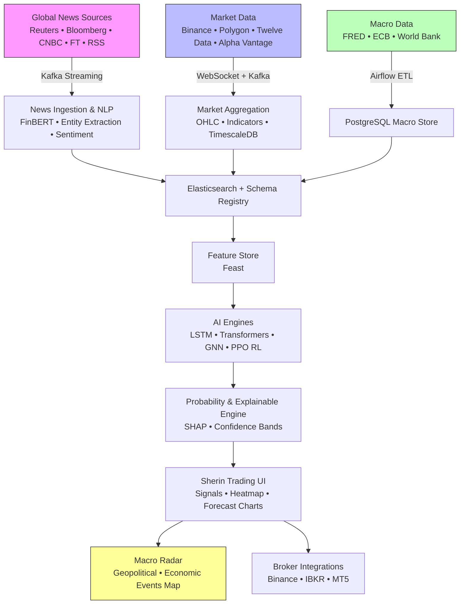

# Sherin AI Financial Intelligence

AI-driven financial platform with live news map, knowledge graph, and probabilistic trading signals.

Phase 1 – Data Foundation in progress.
# Sherin AI Financial Intelligence Platform

**AI-driven financial intelligence system**  
Combining **live global news map**, **knowledge graph**, **probabilistic trading signals**, **sector forecasting**, **macro radar**, and **semi-autonomous trading**.

> From raw news & market data → structured events → explainable predictions → actionable trading intelligence.

Current focus: **Phase 1 – Data Foundation** (real-time ingestion pipelines)

[](https://github.com/rafeez1819/sherin-ai-financial-intelligence/blob/main/LICENSE)
[](https://github.com/rafeez1819/sherin-ai-financial-intelligence)

## System Architecture



# Development Roadmap – Phases 1 to 6
```
gantt
    title Sherin AI Financial Intelligence Roadmap
    dateFormat  YYYY-MM
    axisFormat  %Y-%m
    section Phase 1
    Data Foundation<br>(Ingestion + Storage)     :done, p1, 2026-03, 3m
    section Phase 2
    Intelligence Layer<br>(Knowledge Graph + Events) :active, p2, after p1, 3m
    section Phase 3
    Prediction Engine<br>(Sector + Regime + Probability) : p3, after p2, 6m
    section Phase 4
    Autonomous Agent<br>(RL Trading + Broker Execution) : p4, after p3, 6m
    section Phase 5
    Explainable AI + Macro Radar<br>(SHAP + Counterfactuals + Visualization) : p5, after p4, 3m
    section Phase 6
    Portfolio & Governance<br>(Dynamic Allocation + Model Monitoring + Scaling) : p6, after p5, 3m
```
# Folder Structure (Phases 1–6)
```
sherin-ai-financial-intelligence/
├── .github/workflows/                # CI/CD pipelines
├── docs/                             # Documentation & architecture drawings
│   ├── architecture.md
│   └── phase-plans/
├── infrastructure/                   # Deployment & infra-as-code
│   ├── docker-compose.yml
│   ├── terraform/
│   └── feast-feature-store/
├── src/
│   ├── common/                       # Shared utilities & config
│   ├── phase1-data-foundation/       # Real-time ingestion pipelines (current focus)
│   │   ├── ingestion/                # Reuters, Bloomberg, RSS, Binance, Polygon, FRED...
│   │   ├── processing/               # NLP, aggregation, dead-letter
│   │   ├── validation/
│   │   ├── monitoring/
│   │   ├── feature_store/
│   │   └── docker/
│   ├── phase2-intelligence-layer/    # Knowledge Graph + Event Engine
│   ├── phase3-prediction-engine/     # Sector forecast, regime detection, probability
│   ├── phase4-autonomous-agent/      # RL trading agent + broker connectors
│   ├── phase5-explainable-ai-radar/  # SHAP explanations + macro radar UI
│   └── phase6-portfolio-governance/  # Portfolio optimization + model governance
├── models/                           # Model checkpoints (gitignored large files)
├── notebooks/                        # Exploratory & backtesting notebooks
├── configs/                          # YAML configs, schemas, API keys templates
├── tests/                            # Unit + integration tests per phase
├── data/                             # Small samples only (gitignore large/raw data)
├── .gitignore
├── LICENSE
├── README.md                         # ← this file
└── requirements.txt
```

# Competitive Comparison
```
Feature,Sherin,Freqtrade,FinRL,QLib,Bloomberg Terminal
Live global news ingestion,✓ (multi-source),✗,✗,✗,✓ (very expensive)
Knowledge Graph,✓ (Neo4j planned),✗,✗,Partial,Partial
Probabilistic signals,✓ (with confidence),Partial,RL-focused,✓,✓
Macro event radar / map,✓ (Phase 5),✗,✗,✗,✓
Explainable AI (SHAP etc.),✓ (Phase 5),✗,Limited,Limited,✓
Semi-autonomous execution,✓ (Phase 4),✓,✓,Partial,✗ (manual heavy)
Affordable & open-source base,✓,✓,✓,✓,✗ ($24k+/year)
```
